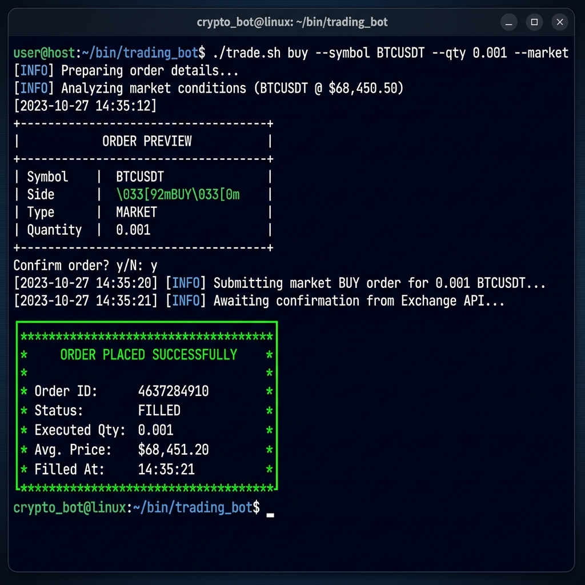
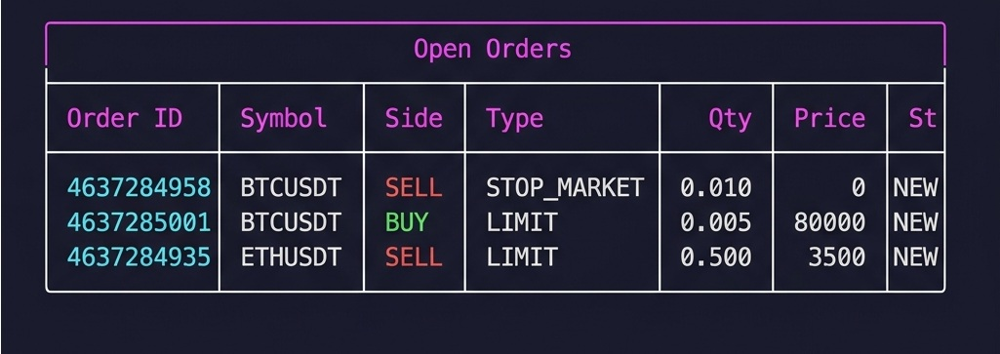
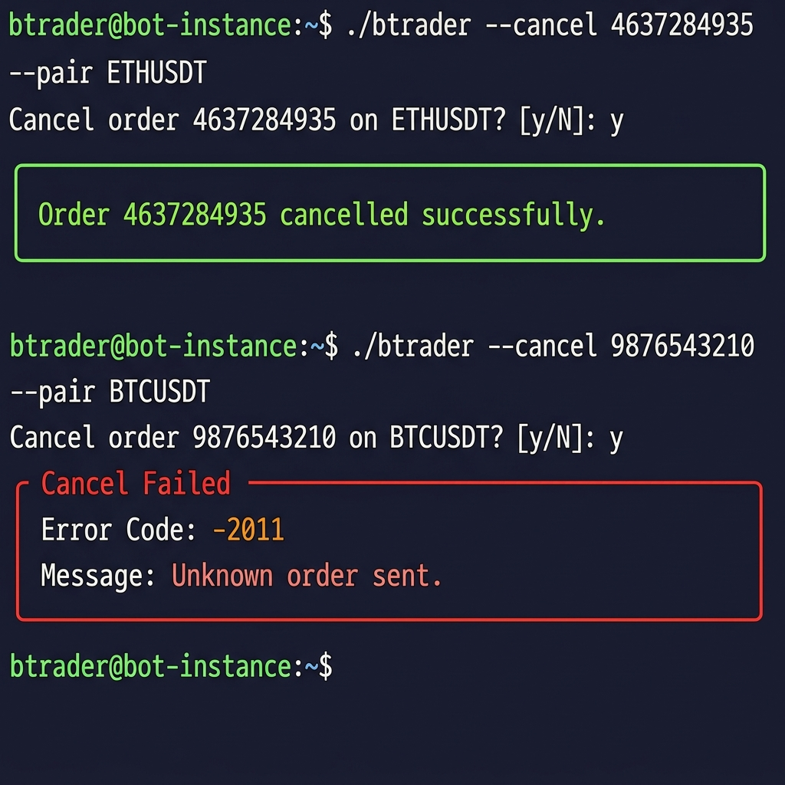

# Primetrade — Binance Futures Testnet CLI Bot


A production-grade command-line trading bot for the Binance Futures Testnet. Place, view, and cancel futures orders through an interactive Rich-powered CLI with full input validation, structured logging, and comprehensive test coverage. Includes a **lightweight web dashboard** for browser-based trading.

---

## Screenshots

### CLI — Place Order



### CLI — View Open Orders



### CLI — Cancel Order & Error Handling



---

## Prerequisites

- **Python 3.10+**
- **Binance Futures Testnet account** — register at [testnet.binancefuture.com](https://testnet.binancefuture.com)
- API Key and Secret generated from the testnet dashboard

---

## Setup

### 1. Clone and enter the project

```bash
git clone https://github.com/viratnigam18/Primetrade.git
cd Primetrade
```

### 2. Create a virtual environment

```bash
python -m venv venv
source venv/bin/activate        # Linux / macOS
venv\Scripts\activate           # Windows
```

### 3. Install dependencies

```bash
pip install -r requirements.txt
```

### 4. Configure credentials

```bash
cp .env.example .env
```

Open `.env` and replace the placeholder values with your Binance Futures Testnet API key and secret:

```
BINANCE_API_KEY=your_testnet_api_key_here
BINANCE_API_SECRET=your_testnet_api_secret_here
```

---

## CLI Usage

All commands are run via `python cli.py`.

### Place a market buy order

```bash
python cli.py place-order --symbol BTCUSDT --side BUY --type MARKET --qty 0.001
```

Expected output:

```
┌─────────────────────────────────┐
│  Order Preview                  │
│  Symbol    BTCUSDT              │
│  Side      BUY                  │
│  Type      MARKET               │
│  Quantity  0.001                 │
└─────────────────────────────────┘
Confirm order? [y/N]: y
╭─ Order Placed Successfully ─────╮
│  Order ID:      100001           │
│  Status:        FILLED           │
│  Executed Qty:  0.001            │
╰──────────────────────────────────╯
```

### Place a limit sell order

```bash
python cli.py place-order --symbol ETHUSDT --side SELL --type LIMIT --qty 0.5 --price 3500.00
```

### Place a stop-market order

```bash
python cli.py place-order --symbol BTCUSDT --side SELL --type STOP_MARKET --qty 0.01 --stop-price 45000.00
```

### Interactive mode (no flags)

```bash
python cli.py place-order
```

The CLI prompts for each missing field with inline validation.

### View open orders

```bash
python cli.py view-orders --symbol BTCUSDT
```

Expected output:

```
┌─────────────────────────────────────────────────────┐
│  Open Orders                                        │
│  Order ID  Symbol    Side  Type   Qty   Price  Stat │
│  100002    ETHUSDT   SELL  LIMIT  0.5   3500   NEW  │
└─────────────────────────────────────────────────────┘
```

### Cancel an order

```bash
python cli.py cancel-order --symbol BTCUSDT --order-id 100002
```

---

## Web Dashboard (Bonus Feature)

A lightweight browser-based trading interface built with **FastAPI** that reuses the existing `bot/` modules with zero business logic duplication.

### Launch the dashboard

```bash
python -m uvicorn web.app:app --reload --port 8000
```

Then open [http://localhost:8000](http://localhost:8000) in your browser.

### Features

| Feature | Description |
|---|---|
| **Order placement** | Form with BUY/SELL toggle, order type selector, and conditional price fields |
| **Live orders table** | Auto-refreshes every 10 seconds; filter by symbol |
| **Cancel orders** | One-click cancel with confirmation dialog |
| **Dark terminal theme** | Premium trading-grade aesthetic with glassmorphism and glow effects |
| **Real-time clock** | Live UTC clock in the footer |
| **Input validation** | Server-side validation via the same `validators.py` used by the CLI |
| **REST API** | `POST /api/orders`, `GET /api/orders`, `DELETE /api/orders/{symbol}/{id}` |

### API Endpoints

```
POST   /api/orders                     — Place a new order
GET    /api/orders?symbol=BTCUSDT      — List open orders (optional symbol filter)
DELETE /api/orders/{symbol}/{order_id} — Cancel a specific order
```

---

## Sample Trading Log

A sample log demonstrating real bot output is included in [`sample_trading_output.txt`](sample_trading_output.txt). It shows:

- ✅ Market BUY order — FILLED
- ✅ Limit SELL order — NEW
- ✅ Stop-Market order — NEW
- ✅ View open orders
- ✅ Cancel order — CANCELED
- ❌ Invalid symbol error (`-1121`)
- ❌ Lot size filter error (`-1013`)
- ❌ Unknown order cancel error (`-2011`)

All logs are automatically written to `logs/trading_bot.log` during operation. The format is:

```
2026-04-16 14:22:01,342 | INFO     | bot.client | >>> POST /fapi/v1/order params={...}
2026-04-16 14:22:01,876 | INFO     | bot.client | <<< POST /fapi/v1/order status=200 body={...}
```

Sensitive data (signatures) is always stripped before logging.

---

## Docker

### Build

```bash
docker build -t primetrade .
```

### Run

```bash
docker run --rm --env-file .env primetrade place-order \
  --symbol BTCUSDT --side BUY --type MARKET --qty 0.001
```

---

## Running Tests

```bash
pytest tests/ -v
```

All tests use mocked HTTP responses — no network or API credentials required.

---

## Architecture

```
Primetrade/
├── bot/
│   ├── config.py           # Environment loading, constants
│   ├── client.py           # HTTP transport, HMAC signing, retries
│   ├── validators.py       # Input validation with typed errors
│   ├── orders.py           # Order models and business logic
│   └── logging_config.py   # Rotating file logger
├── web/
│   ├── app.py              # FastAPI REST API + dashboard server
│   ├── templates/
│   │   └── index.html      # Single-page trading dashboard
│   └── static/
│       ├── style.css        # Dark terminal theme
│       └── app.js           # Client-side order management
├── tests/
│   ├── test_client.py      # HTTP layer unit tests
│   ├── test_validators.py  # Validation edge case tests
│   └── test_orders.py      # Order logic unit tests
├── screenshots/            # CLI output screenshots
├── cli.py                  # Typer + Rich entry point
├── Dockerfile              # Multi-stage container build
├── .env.example            # Credential template
├── requirements.txt        # Pinned dependencies
├── sample_trading_output.txt # Demo log output
└── logs/                   # Rotating log output
```

### Separation of Concerns

| Layer | Responsibility |
|---|---|
| **config** | Loads environment variables at startup; fails immediately if credentials are missing. Houses all tuneable constants (timeouts, retry counts, recv window). |
| **client** | Pure HTTP transport. Signs every request with HMAC-SHA256, attaches timestamps, handles retries with exponential backoff, and raises `APIError` / `NetworkError`. Never contains business logic. |
| **validators** | Stateless input validation. Each function targets a single field, returning the cleaned value or raising `ValidationError` with the exact field name and reason. |
| **orders** | Business logic layer. Composes validators and client calls, maps Binance error codes to human-readable messages, and returns Pydantic-modelled responses. |
| **logging** | Centralised rotating file logger. Every request, response, and error is recorded with timestamps. API secrets are stripped before logging. |
| **cli** | User-facing shell. Handles interactive prompts, Rich table rendering, and confirmation flows. The only layer allowed to use `print`-style output. |
| **web** | FastAPI dashboard. Thin REST wrapper over `bot/` — exposes the same order operations through a browser UI with zero logic duplication. |

---

## Assumptions and Known Limitations

- **Testnet only** — the base URL points to `testnet.binancefuture.com`. Switching to production requires changing `BASE_URL` and using live credentials.
- **USDT-M futures** — the bot targets linear (USDT-margined) perpetual contracts. Coin-margined endpoints are not supported.
- **Order types** — only MARKET, LIMIT, and STOP_MARKET are implemented. OCO, TRAILING_STOP, and other types are out of scope.
- **No WebSocket streaming** — the bot uses REST polling only. Real-time price feeds or order updates require a WebSocket integration.
- **Single-account** — the bot operates on one API key pair. Multi-account support is not implemented.
- **Rate limits** — the bot does not proactively track Binance rate limit headers. Under heavy usage, you may hit exchange-side throttling.
- **Symbol info** — quantity precision and min notional are not fetched from the exchange dynamically. The bot validates up to 8 decimal places locally but does not pull `exchangeInfo` filters.

---

## License

MIT